 

# inaspace: 
#### A Simple Solution for Corporate Room Booking
Welcome to inaspace, the straightforward application designed for booking rooms within a corporate setting. Whether you need a space for meetings, conferences, or team sessions, inaspace makes it easy to find and reserve the perfect room. Enjoy a hassle-free experience with our intuitive room management system.

## Deployed Site:
[Click here to view deployed site on Heroku](https://inaspace-4c7fc427a59a.herokuapp.com/)

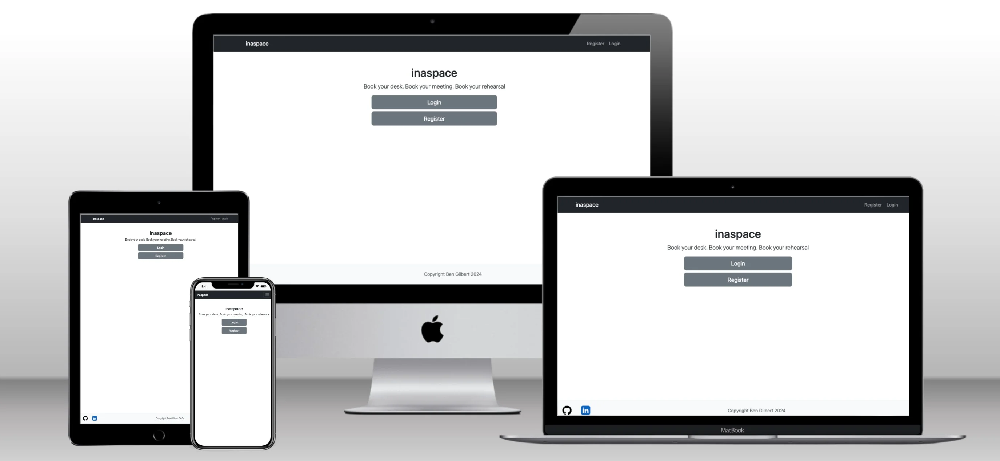

## Table of Contents
- [Introduction](#introduction)
- [UX](#ux)
   * [Account Creation and Login](#account-creation-and-login)
   * [Dashboard Overview](#dashboard-overview)
   * [Room Booking Management](#room-booking-management)
   * [Customisation and Personalisation](#customization-and-personalization)
- [Project Planning](#project-planning)
   * [Wireframes](#wireframes)
   *  [Database Schema](#database-schema)
       - [Models](#models)
   - [Agile Methodologies ](#agile-methodologies)
       * [Epics](#epics)
       * [User stories](#user-stories)
       * [Kanban board](#kanban-board)
   - [Technologies Used](#technologies-used)
       * [Languages](#languages)
       * [Frameworks](#frameworks)
       * [Libraries & Packages](#libraries--packages)
- [Future Features](#future-features)
- [Testing](#testing)
- [Deployment](#deployment)
   * [Heroku](#heroku)
   * [GitHub](#github)
- [Credits](#credits)
   * [Media](#media)
   * [Acknowledgements](#acknowledgements)

## Introduction
Introducing 'inaspace'..a room booking application for multi-purpose organisations. From office reservations to meeting scheduling and rehearsal studio bookings, 'inaspace' streamlines the process with a minimalist yet highly efficient design, enhancing user experience. Easily tailored to fit your organisation's structure, 'inaspace' ensures seamless coordination and optimal space utilisation, eliminating scheduling conflicts and administrative hassles.

## UX
The 'inaspace' user experience is designed with simplicity and efficiency in mind, ensuring a seamless interaction from start to finish.

#### Account Creation and Login:

   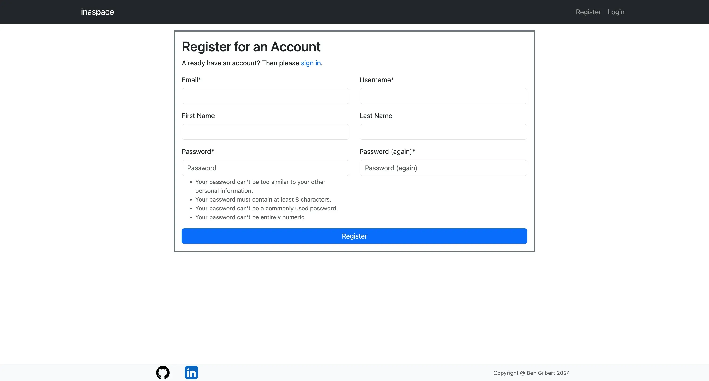
   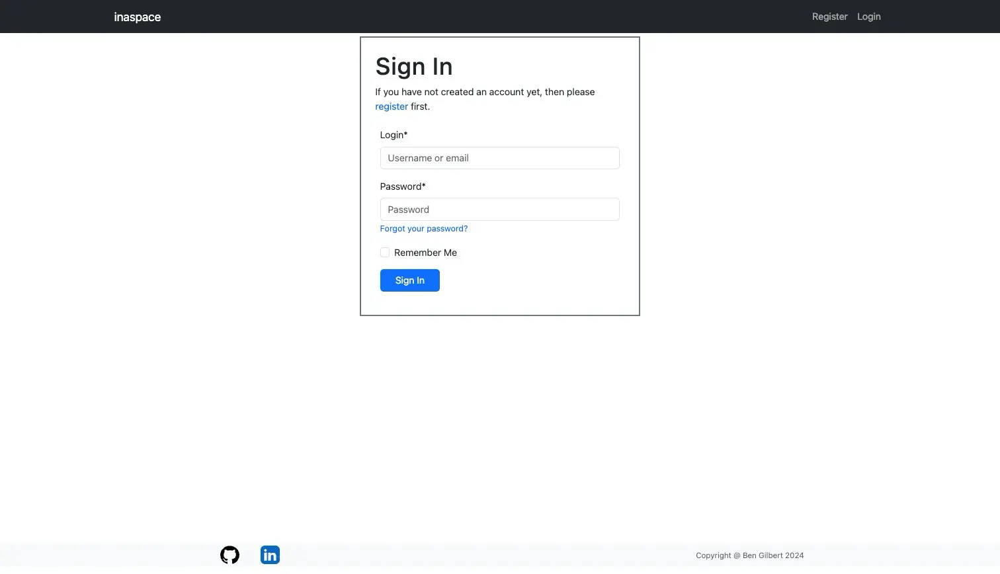
   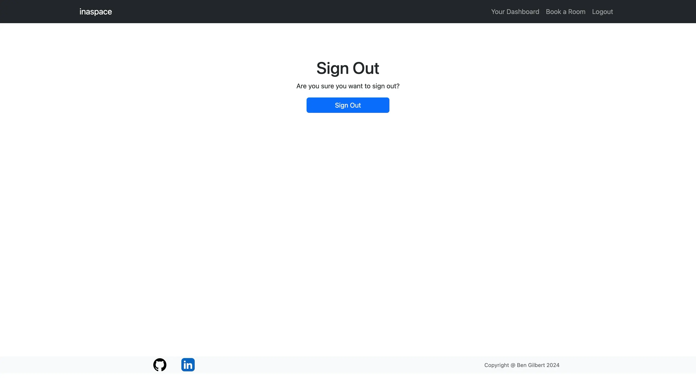

Users begin by creating an account with a straightforward sign-up process, providing essential details such as name, email, and a secure password. Once registered, users can easily log in and out with their credentials, and with django-allauth, their data remains private and secure.

#### Dashboard Overview:

   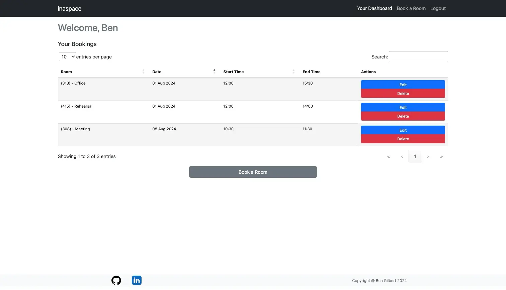

Upon logging in, users are greeted with a clean and intuitive dashboard. This central hub provides a quick overview of current bookings, upcoming reservations, and available rooms. The minimalist design ensures that all necessary information is accessible at a glance.

#### Room Booking Management:
The core functionality of 'inaspace' revolves around its robust room booking system, featuring full CRUD (Create, Read, Update, Delete) capabilities. Messages are displayed to the user confirming their actions throughout the process:

- Create: Users can effortlessly create new bookings by selecting a room, date, and time slot. Additional details such as the purpose of the booking and any special requirements can be added to ensure everything is prepared in advance.

   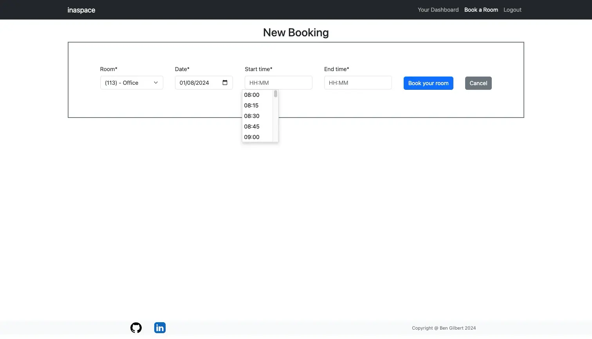

- Read: All current and past bookings are easily accessible. Users can view detailed information about each reservation, including room specifications and booking history.

   

- Update: Should changes be necessary, users can quickly modify their bookings. Adjustments to time, date, or room selection are made with just a few clicks, ensuring flexibility and adaptability. Edit Form is rendered with data to be edited and option to cancel action is available.

   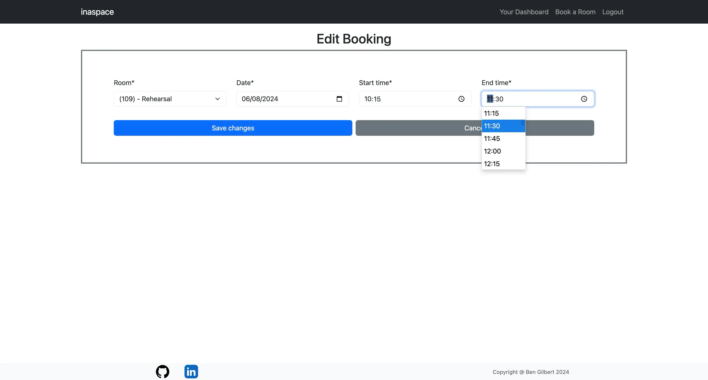

- Delete: If a booking is no longer needed, users can simply delete it, freeing up the space for others and maintaining an organised schedule.

   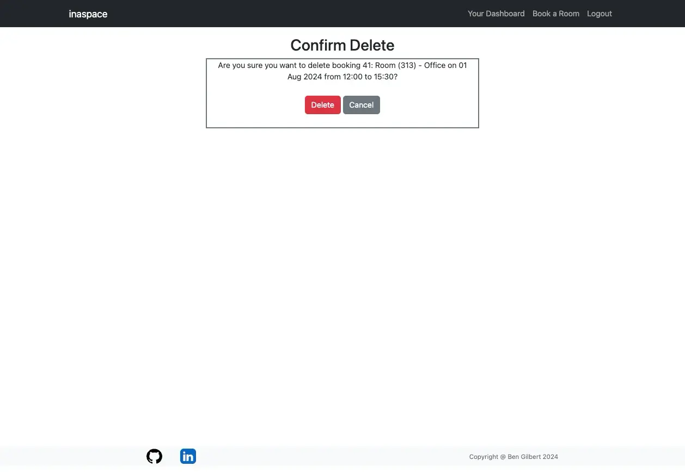

#### Customization and Personalization:
'inaspace' can be tailored to fit the unique structure of any organisation. Administrators can customise room details, booking rules, and user permissions, ensuring the application aligns perfectly with organisational needs. This adaptability ensures that 'inaspace' remains a valuable tool for any multi-purpose organisation, regardless of size or complexity.

## Project planning

### Wireframes
#### Home Page

 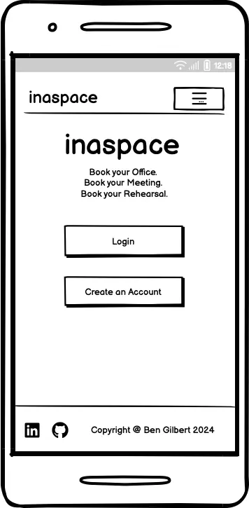
 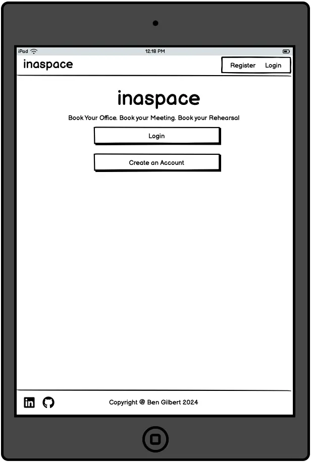

#### Profile Page

 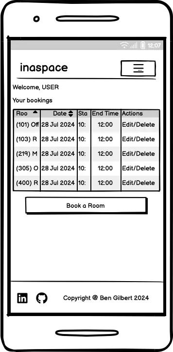
 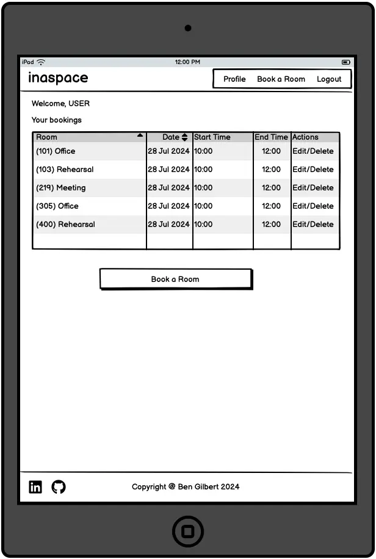

### Database Schema
 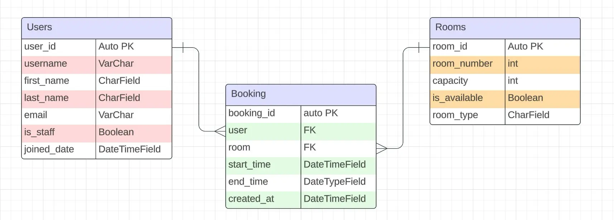

### Models
#### User
The User model is based on Django's built-in authentication system, providing a robust and secure way to manage user accounts. It includes standard fields such as username, password, email, and has been extended by adding first_name and last_name, is_staff and joined_date.

#### Room
The Room model represents the various rooms available for booking within the inaspace application. Each room has the following attributes:

- name: A unique identifier for the room. In this case a fictional building was created featuring 4 floors of rooms numbered 101 - 115, 201 - 215 etc.
- description: Detailed information about the room, including features and amenities.
- capacity: The maximum number of occupants the room can accommodate.

#### Booking
The Booking model allows users to reserve rooms for specific dates and times. It includes the following fields:

- user: A reference to the User who made the booking.
- room: A reference to the Room being booked.
- start_time: The starting time of the booking.
- end_time: The ending time of the booking.
- booking_date: The date for which the booking is made.

### Agile Methodologies

#### Epics
The development process was structured into three main Epics: Setup, User Account Management, and CRUD Functionality. Each Epic was broken down into specific User Stories to ensure a systematic and organised development workflow. Githubs Kanban board feature was used to manage the process.
 

 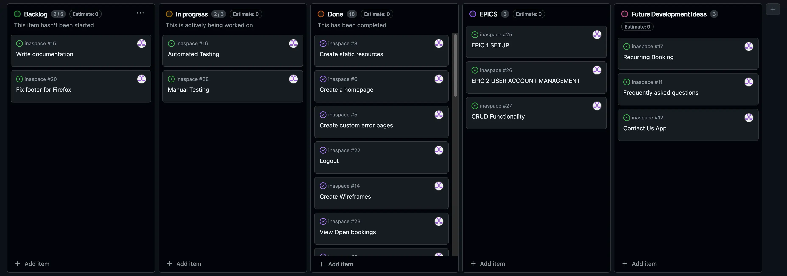

#### User stories
1. As a developer I can setup the project so that it is ready for implementing core features.
2. As a developer I can create base.html so that other pages can reuse the layout.
3. As a developer I can create static resources so that so that assets, css and js work throughout the site.
4. As a user I can sign up/create an account so that I can access website features.
5. As a user I can see custom 403, 404 and 500 error pages so that I can understand what error has occurred
6. As a user I can see a home page when first arriving so that information about the app is easily accessible.
7. As a logged in user I can select a room and time so that I can create a room booking.
8. As a logged in user I can select edit or delete so that I can amend an existing booking associated with my account.
9. As a user I can receive feedback when performing CRUD operations so that I know it was complete successfully.
10. As a User I can use clearly presented forms so that perform actions within the site.
11. As a developer I can deploy app to heroku so that users can access the site.
12. As a developer I can create wireframes so that I can have a clear idea of how my site will look.
13. As a developer I can create a detailed README.md so that others can understand my methodologies for creating 'inaspace'.
14. As a developer I can use Django's automated testing features so that ensure functionality of all site elements.
15. As a developer I can create a database schema so that all relevant data are stored and accessible.
16. As a developer I can use UserPassesTestMixin so that database is protected from unauthorised access.
17. As a user I can see different navigation options so that I can log out when logged in and vice-versa.
18. As a User I can logout so that I can leave the app.
19. As a site admin I can see all bookings so that I can manage the booking system effectively.
20. As a User I can view a list of my open bookings.
21. As a Developer I can manually test all aspects of the app so that I can ensure the app functions as expected.

Details of the acceptance criteria for the USer Stories is found via the link to the Kanban Board in the following section.

Note: 3 other user stories have been added to Future Development Ideas below.

#### Kanban board
[Click here to view Kanban board on Github](https://github.com/users/bengilbertcodes/projects/6/views/1)

### Future Features
- Add Contact the Developer app
- Add Frequently Asked Questions app
- User to be able to select room type from drop down then see the room numbers corresponding to that room type. Require additional table in database (room_type with a primary key of room_type_id which will join to rooms table).
- Unavailable room times not visible to the user when selecting times. I have not been able to implement this important feature at this time.
- User can request equipment for a room - office equipment or instruments for a rehearsal for example.
- I didn't feel the need to add more clutter onto the pages so left out a how to use section. This could easily be added as a modal and would be particularly useful should the functionality of the site increase. Styling has deliberately been kept simple to allow the app to work as efficiently as possible. If a company wished to use this app it would be easy to adpat it for their own branding/colours/themse etc.
- Text input is currently allowed in the start and end time fields of the booking form. In a future version I'd like to disable text input.

### Technologies Used

#### Languages
- HTML
- CSS
- Javascript
- Python

#### Frameworks
- Django - Python framework used in development.
- Bootstrap 5 - CSS Framework used for styling the application

#### Libraries & Packages
- Django Allauth - Used for authentication and account registration
- Django Crispy Forms - used to simplify the rendering of Django forms.
- DataTable [link to datatables.net](https://datatables.net/). Allows ordering of bookings table.
- jQuery Timepicker - used to customise the booking form.
- Guicorn - Python HTTP server, used as web server to run Django on Heroku.

#### Tools & Programs
- VSCode
- Github Pages
- Github Kanban Board
- [Code Institute Postgres database](https://dbs.ci-dbs.net/) was the database used.
- Chrome and Firefox Dev tools
- Lucidchart - used to create the database schema plan
- Balsamiq - used to create wireframes during the design process
- Heroku - platform used for app deployment
- PEP8 - To ensure code meets PEP8 requirements
- HTML Validator
- W3 CSS Validator
- JShint

### Testing
For full testing results see [TESTING.md](/TESTING.md)

### Deployment

#### Heroku

Heroku was used to deploy the site. Here are the steps to deploy:

1. Log in to Heroku.
2. Click "Create a new app".
3. Choose the app name and region.
4. Click "Create app".
5. Navigate to the "settings" tab.
6. "Click "Reveal Config Vars".
7. Add DATABASE_URL, SECRET_KEY to Config Vars
8. Scroll down to "Buildpacks".
9. Click "Add Buildpack".
10. Add "heroku/python".
11. Return to "Deploy" tab.
12. Select Github as Deployment Method and connect to the repository.
13. In 'Manual Deploy' click 'Deploy Branch'
14. Click 'Open App' to view the deployed version.

#### GitHub
Github was used to store the repository.
Changes made within VSCode were pushed to Github using the follwing commands:
- git add .
- git commit -m 'message'
- git push

A fork can be created by navigating to the repository, clicking the fork button and selecting 'create fork. The name can be altered and a description can be added. Just the Main Branch or all Branches can be added to the new fork. Click Create a Fork and the repository will appear in your Github.

The repository can be cloned by selecting the Code button and copyong the link. This link can be used to create a local clone in your editor or IDE.

### Credits
- [startbootstrap.com - Bare template](https://startbootstrap.com/template/bare) - used to establish basic layout and navigation structure.
- [codemy.com - Intro to Django - Resume Website course](https://members.codemy.com/l/intro-to-django-resume-website/) - to help improve my understanding of Django applications.
- [codemy.com - User authentication with Python and Django course](https://members.codemy.com/l/user-authentication-with-python-and-django/) - to help improve my understanding of Django applications.
- [Dee Mc - Youtube - Recipe Sharing and Meal Planning app tutorial](https://www.youtube.com/watch?v=sBjbty691eI&list=PLXuTq6OsqZjbCSfiLNb2f1FOs8viArjWy&ab_channel=DeeMc) - Used to help with the implementation of Mixins.
- [Gareth McGirr - Sizzle and Steak repo](https://github.com/Gareth-McGirr/Portfolio-Project-4-SizzleAndSteak) - for assistance structuring the booking system.
- [Code Institute - I Think Therefore I Blog walkthrough](https://learn.codeinstitute.net/)
- [Stackoverflow](https://stackoverflow.com/questions/61817323/how-to-convert-my-simple-table-to-the-datatables) - for help setting up DataTables

#### Acknowledgements
Gareth McGirr - as my mentor through this project.
Natalie Beddow, Dan McKeown, Malin Christina, Terry Gilbert - for being great testers.
