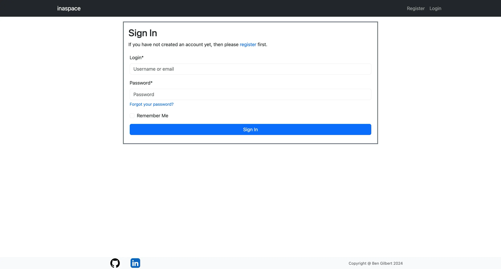
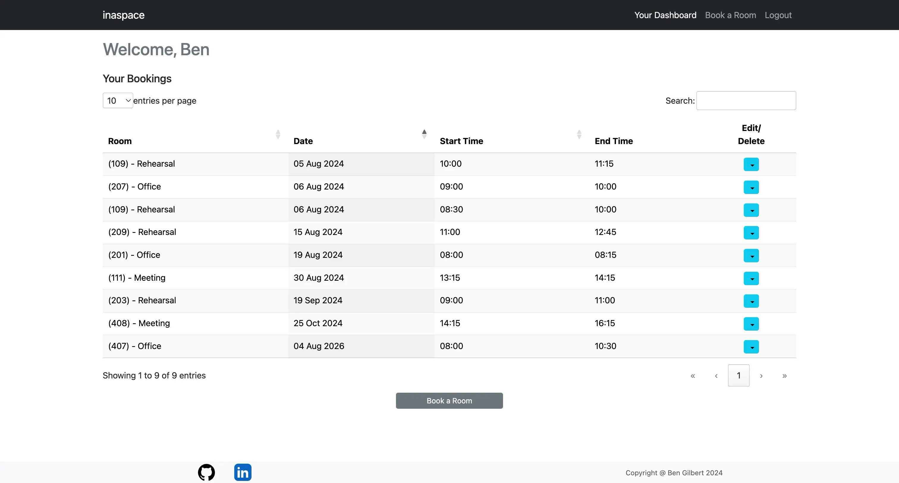
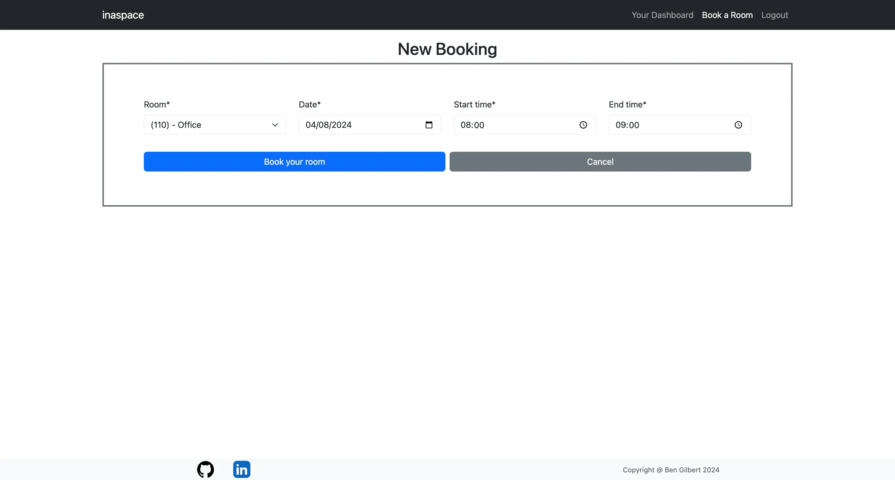
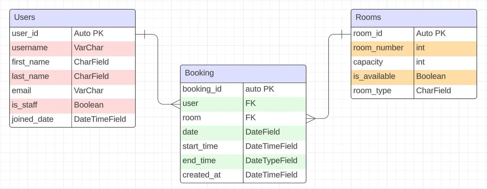

 
 

# inaspace:  A straightforward application for booking rooms within a corporate setting
 

## Table of Contents
- [Introduction](#Introducing 'inaspace')
- [UX](#ux)
- [Design](#design)
- [Project Planning](#project-planning)
    * [Wireframes](#wireframes)
    *  [Database Schema](#database-schema)
        - [Models](Models)
    - [Agile Methodologies ](#agile-methodologies)
        * [Epics](#epics)
        * [User stories](#user-stories)
        * [MoSCoW prioritization](#moscow-prioritization)
        * [Kanban board](#kanban-board)
    - [Technologies Used](#technologies-used)
        * [Languages](#languages)
        * [Frameworks](#frameworks)
        * [Libraries](#libraries)
- [Testing](#testing)
- [Features](#features)
    * [Future Features](#future-features)
- [Deployment](#deployment)
    * [GitHub](#github)
    * [Heroku](#heroku)
- [Credits](#credits)
    * [Code](#code)
    * [Media](#media)
    * [Acknowledgements](#acknowledgements)

## Introducing 'inaspace'
 ..the ultimate room booking application for multi-purpose organizations. From office reservations to meeting scheduling and rehearsal studio bookings, 'inaspace' streamlines the process with a minimalist yet highly efficient design, enhancing user experience. Easily tailored to fit your organization's structure, 'inaspace' ensures seamless coordination and optimal space utilization, eliminating scheduling conflicts and administrative hassles.

## UX
The 'inaspace' user experience is designed with simplicity and efficiency in mind, ensuring a seamless interaction from start to finish.

#### Account Creation and Login:

	
	
	

Users begin by creating an account with a straightforward sign-up process, providing essential details such as name, email, and a secure password. Once registered, users can easily log in and out with their credentials, and with django-allauth, their data remains private and secure.

#### Dashboard Overview:

	

Upon logging in, users are greeted with a clean and intuitive dashboard. This central hub provides a quick overview of current bookings, upcoming reservations, and available rooms. The minimalist design ensures that all necessary information is accessible at a glance.

#### Room Booking Management:
The core functionality of 'inaspace' revolves around its robust room booking system, featuring full CRUD (Create, Read, Update, Delete) capabilities. Messages are displayed to the user confirming their actions thorughout the process:

- Create: Users can effortlessly create new bookings by selecting a room, date, and time slot. Additional details such as the purpose of the booking and any special requirements can be added to ensure everything is prepared in advance.

	

- Read: All current and past bookings are easily accessible. Users can view detailed information about each reservation, including room specifications and booking history.

	

- Update: Should changes be necessary, users can quickly modify their bookings. Adjustments to time, date, or room selection are made with just a few clicks, ensuring flexibility and adaptability. Edit Form is rendered with data to be edited and option to cancel action is available.

	

- Delete: If a booking is no longer needed, users can simply delete it, freeing up the space for others and maintaining an organized schedule.

	

#### Customization and Personalization:
'inaspace' can be tailored to fit the unique structure of any organization. Administrators can customize room details, booking rules, and user permissions, ensuring the application aligns perfectly with organizational needs. This adaptability ensures that 'inaspace' remains a valuable tool for any multi-purpose organization, regardless of size or complexity.

## Project planning

### Wireframes
#### Home Page

  
   

#### Profile Page 

  
   

### Database Schema
  

### Models

### Agile Methodologies

#### Epics

#### User stories

#### MoSCoW prioritization

#### Kanban board

### Technologies Used

#### Languages

#### Frameworks

#### Libraries

#### Tools & Programs

### Testing

### Deployment

#### GitHub

#### Heroku

### Features

### Credits

#### Acknowledgements
