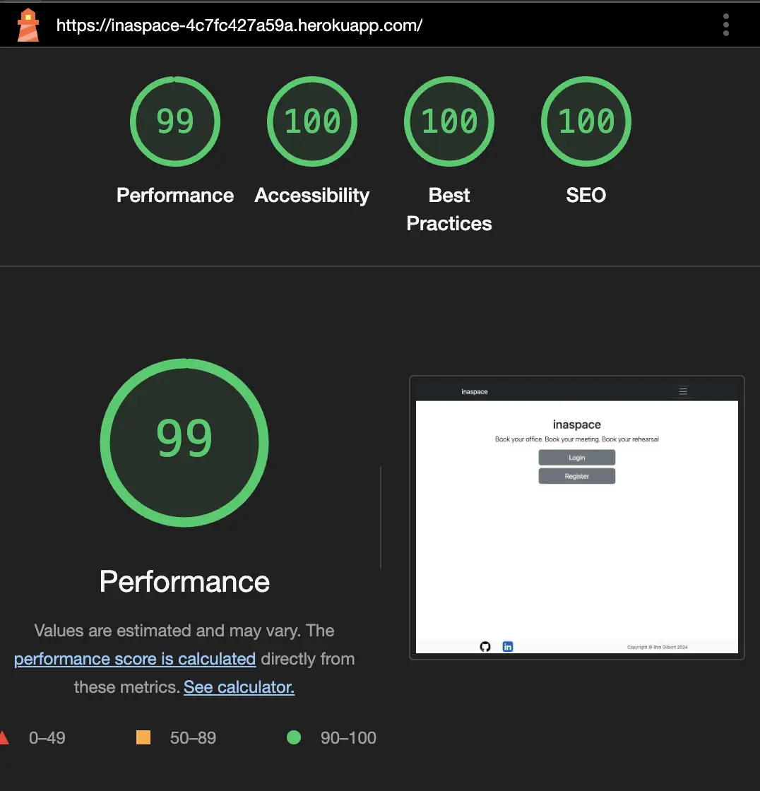
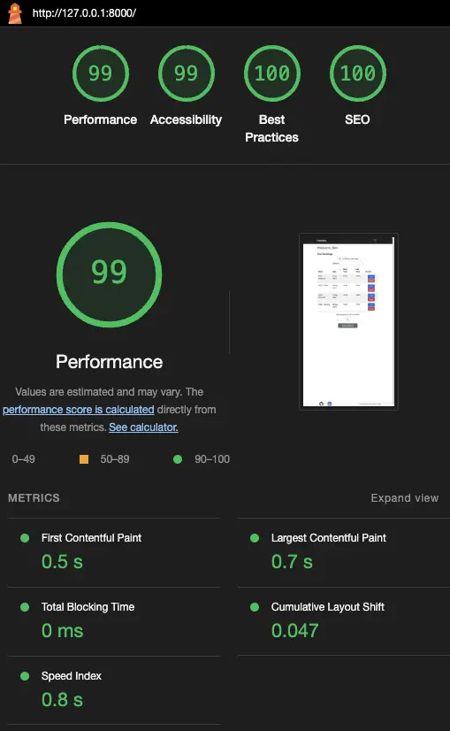
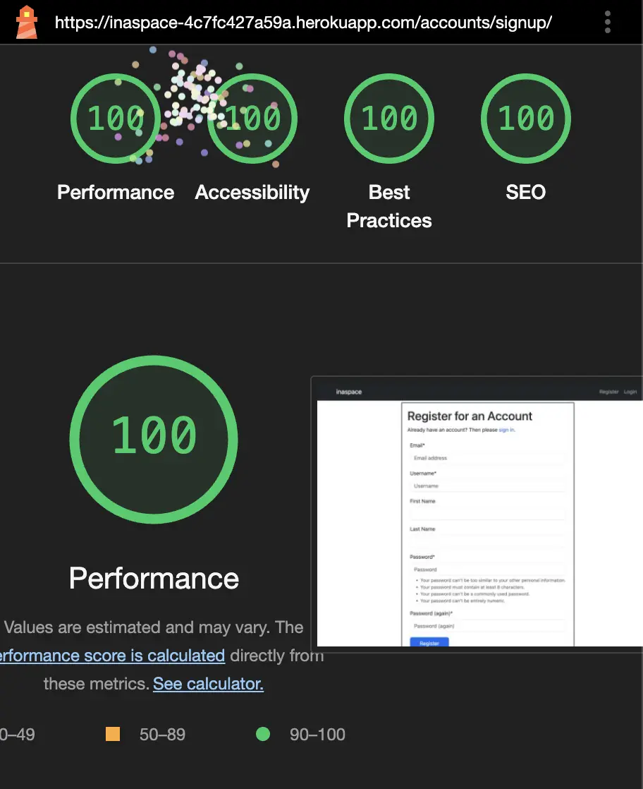
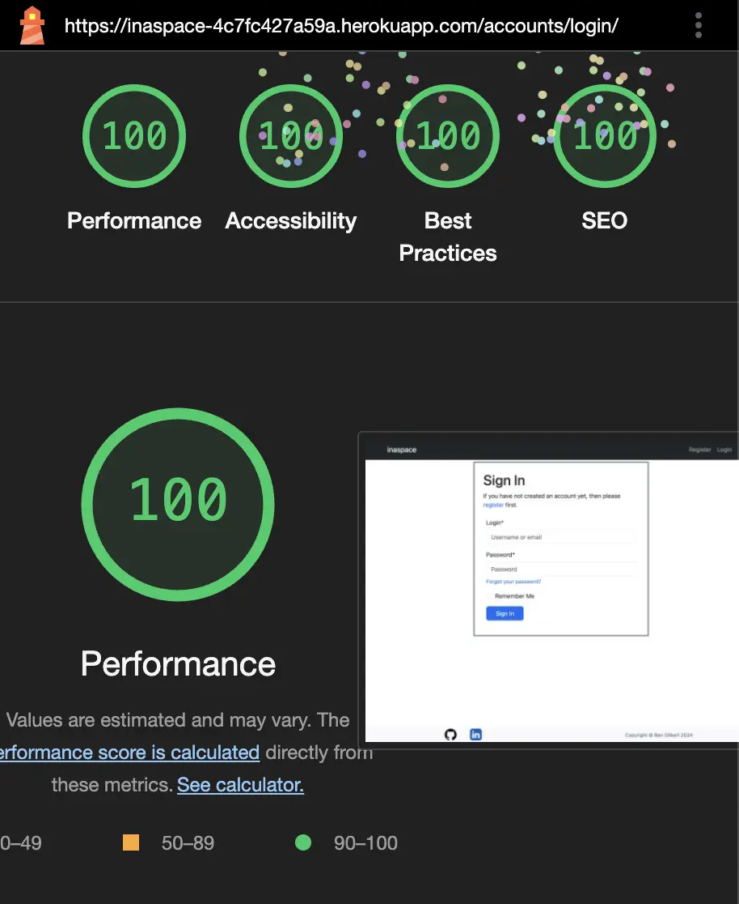
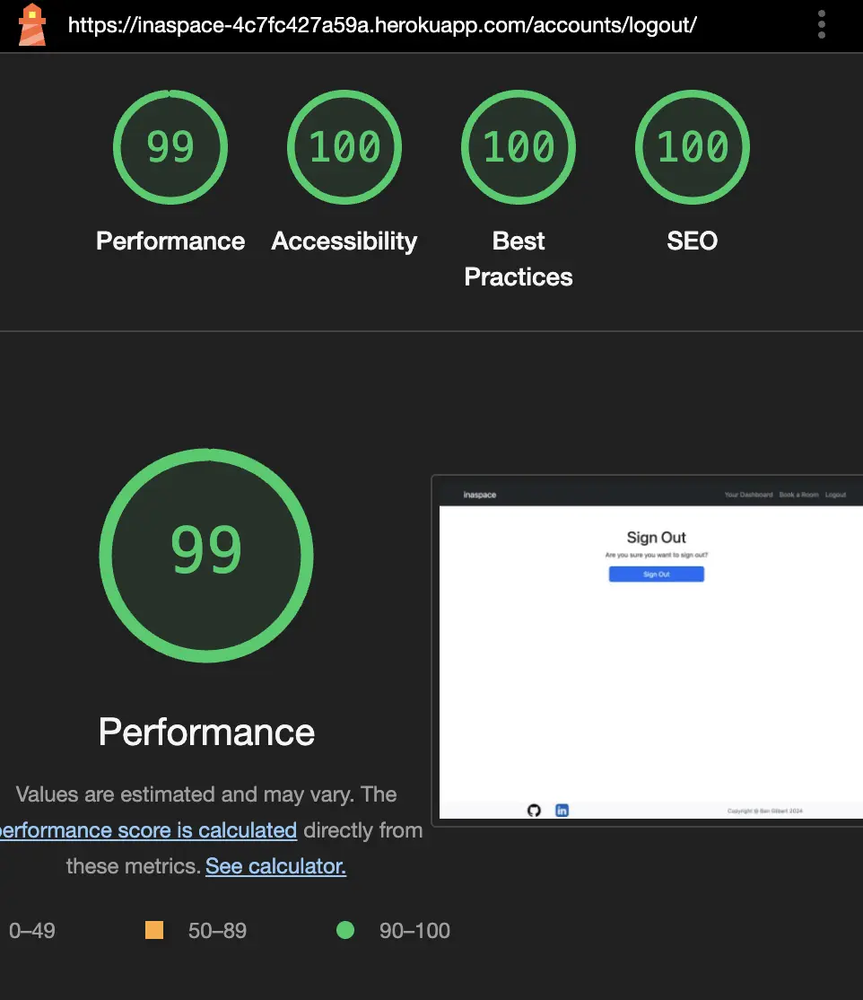
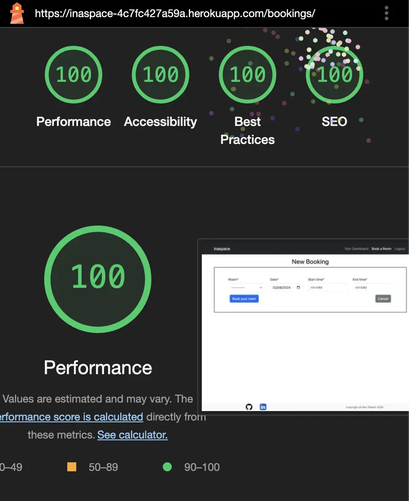

# inaspace - Testing details

[Main README.md file](README.md)  
[View the website on Heroku](https://inaspace-4c7fc427a59a.herokuapp.com/)

## Validator Testing

### HTML
All the HTML files were checked with [W3C Markup Validation Service](https://validator.w3.org/) and errors identified addressed.

### CSS

CSS files were checked with [(Jigsaw) validator](https://jigsaw.w3.org/css-validator/validator.html.en) with no errors.

### JavaScript
JS files were checked with [JSHint](https://jshint.com/) with no errors.

### Python 
[CI Python Linter](https://pep8ci.herokuapp.com/#) was used to validate the Python code. All the errors highlighted were fixed. 

## Lighthouse Testing
Lighthouse tests using Chrome Dev tools in an incognito window.

- **Homepage**:

	

- **Dashboard page**:

	

- **Registration Form**:

	

- **Login Form**:

	

- **Logout page**:

	

- **Booking Form**:

	

## Manual testing

<h2>Test Cases</h2>

<table>
    <tr>
        <th>Test Case ID</th>
        <th>Test Description</th>
        <th>Preconditions</th>
        <th>Test Steps</th>
        <th>Expected Result</th>
        <th>Status</th>
    </tr>
    <tr>
        <td>TC001</td>
        <td>User Registration</td>
        <td>User must not be logged in</td>
        <td>
            <ol>
                <li>Navigate to registration page</li>
                <li>Fill in user details</li>
                <li>Submit form</li>
				<li>Alerts for any incomplete fields are displayed</li>
            </ol>
        </td>
        <td>User account is created and confirmation message is displayed</td>
        <td>Pass</td>
    </tr>
    <tr>
        <td>TC002</td>
        <td>User Login</td>
        <td>User account must exist</td>
        <td>
            <ol>
                <li>Navigate to login page</li>
                <li>Enter valid credentials</li>
                <li>Submit form</li>
            </ol>
        </td>
        <td>User is redirected to the dashboard</td>
        <td>Pass</td>
    </tr>
    <tr>
        <td>TC003</td>
        <td>Invalid Login</td>
        <td>User account must exist</td>
        <td>
            <ol>
                <li>Navigate to login page</li>
                <li>Enter invalid credentials</li>
                <li>Submit form</li>
            </ol>
        </td>
        <td>Error message is displayed indicating invalid credentials</td>
        <td>Pass</td>
    </tr>
    <tr>
        <td>TC004</td>
        <td>Password Reset</td>
        <td>User must have a registered email</td>
        <td>
            <ol>
                <li>Navigate to password reset page</li>
                <li>Enter registered email</li>
                <li>Submit form</li>
            </ol>
        </td>
        <td>Password reset link is sent to the email</td>
        <td>Pass</td>
    </tr>
    <tr>
        <td>TC005</td>
        <td>Create New Room Booking</td>
        <td>User must be logged in</td>
        <td>
            <ol>
                <li>Navigate to Book a Room page</li>
                <li>Enter Booking details</li>
                <li>Submit Booking</li>
            </ol>
        </td>
        <td>New Booking is created and displayed on Users dashboard</td>
        <td>Pass</td>
    </tr>
    <tr>
        <td>TC006</td>
        <td>Edit an existing Room Booking</td>
        <td>User must be logged in</td>
        <td>
            <ol>
                <li>Navigate to Dashboard page</li>
                <li>Click on edit</li>
                <li>Update details</li>
                <li>Save changes</li>
            </ol>
        </td>
        <td>Existing booking is updated and new version is displayed on Users dashboard</td>
        <td>Pass</td>
    </tr>
    <tr>
        <td>TC007</td>
        <td>Delete an existing Room Booking</td>
        <td>User must be logged in</td>
        <td>
            <ol>
                <li>Navigate to Dashboard page</li>
                <li>Click delete on required record</li>
                <li>Click Delete on confirmation page</li>
            </ol>
        </td>
        <td>Existing booking is deleted and dashboard is updated</td>
        <td>Pass</td>
    </tr>
    <tr>
        <td>TC008</td>
        <td>Logout</td>
        <td>User must be logged in</td>
        <td>
            <ol>
                <li>Click on the logout nav bar link</li>
                <li>Confirm user wants to sign out</li>
            </ol>
        </td>
        <td>User is logged out and redirected to the home page</td>
        <td>Pass</td>
    </tr>
</table>

## Notes
- The calendar functions well. It is not possible for users to book rooms on 29th February if not a leap year, for example.
- It is possible for a user to book multiple rooms at the same time - I have left this feature in as it could be useful by an admin to book multiple rooms for colleagues/students etc. 
- 'Tabbing' (tabindex) through registration form works up until password 1, then tab moves to 'inaspace' in the navbar. I haven't found a solution to this yet.
- On Android devices, the timepicker disappears when the keyboard overlay renders. Times can still be manually typed and a longer press on the input field can return the timepicker but this is not an ideal solution. I intend to fix this for future builds.

## Automated testing
The functionalities tested can be seen in:
 - home/test_views.py
 - bookings/test_forms.py
 - bookings/test_views.py

All tests pass.

## Browser and OS Compatibility
Browsers that have been tested:
- Chrome
- Firefox
- Safari
- Edge

Operating Systems
- MacOS Sonoma
- Windows 10
- iOS
- Android

## Responsiveness 
The website's responsiveness has been tested using Google Chrome Developer Tools. To ensure compatibility across different devices, various screen resolutions were simulated.

The website displays responsively across a wide range of devices and screen sizes.
